## The network of interactions
**It is interesting to contemplate a tangled bank, clothed with many plants of many kinds, with birds singing on the bushes, with various insects flitting about, and with worms crawling through the damp earth, and to reflect that these elaborately constructed forms, so different from each other, and dependent upon each other in so complex a manner, have all been produced by laws acting around us.**
*On the Origin of Species (1859) by Charles Darwin*

**If you look at the world in a certain way, everything is connected to everything else.**
*Foucault's Pendulum (1988) by Umberto Eco* 

## Interactions at play in the Serengeti
<div class="centered">
 
</div>

## Tree growth (Packer et al. Science 2005)

<div class="centered">
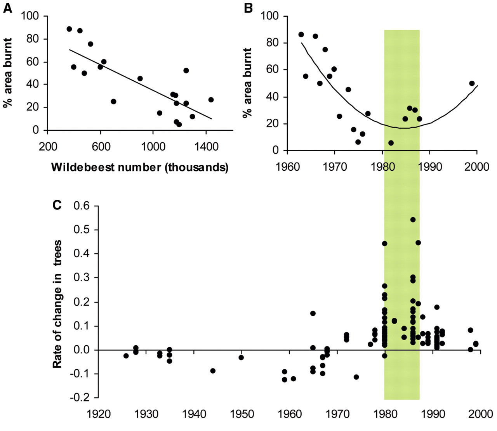 
</div>

## The players: Trees

<div class="centered">
 
</div>

## The players: Elephants

<div class="centered">
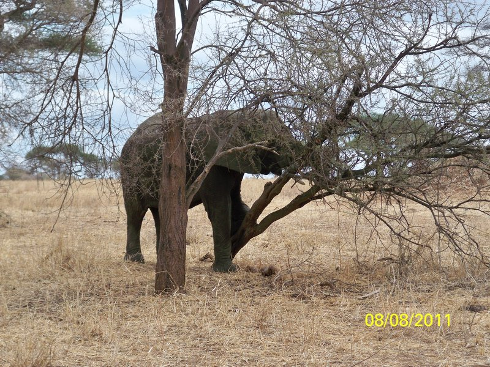 
</div>

## The players: Grass

<div class="centered">
 
</div>

## The players: Fire

<div class="centered">
 
</div>

## The players: Wilderbeest

<div class="centered">
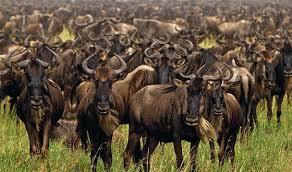 
</div>

## The players: A virus?!

<div class="centered">
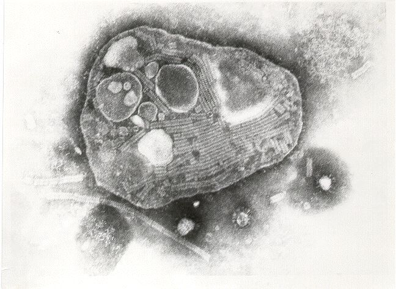 
</div>


## Interactions at play in the Serengeti

<div class="centered">
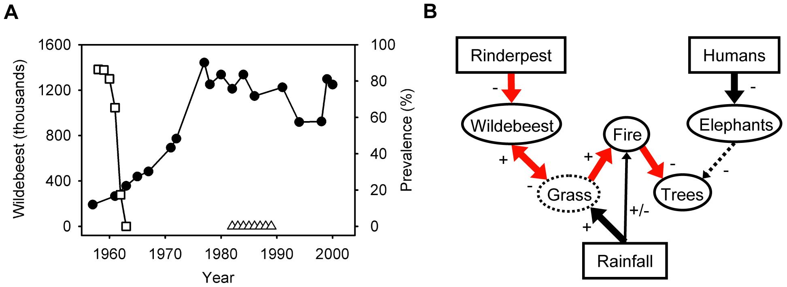 

Holdo et al., 2009
</div>

## Types of interaction between species

- *Competition (-, -)*

- *Antagonism (+, -)*, e.g., consumption, parasitism.

- *Mutualism (+, +)*, e.g., pollination, seed-dispersal, symbiosis

- *Amensalism (-, 0)* 

- *Commensalism (+, 0)*

## Network structure

## Lorenzo Camerano: the first food web

## Modern food web

## Lotka Volterra Equations

## Volterra effect

## LV Competition

$\dfrac{d X_1}{dt} = X_1 \left( r_1 - A_{1,1} X_1 - A_{1,2} X_2 \right)$

$\dfrac{d X_2}{dt} = X_2 \left( r_2 - A_{2,2} X_2 - A_{2,1} X_1 \right)$

$A_{1,1}$: intra-specific competition species 1

$A_{1,2}$: inter-specific competition --- effect of species 2 on growth of species 1

if $A_{1,1} > A_{1,2}$ adding a conspecific decreases growth more than adding heterospecific

## Qualitative analysis

- Determine Equilibria

- Determine isoclines of null growth (nullclines)

- Assess stability of equilibria graphically

- Assess stability using invasibility

- Competitive exclusion

## Equilibria

$\dfrac{d X_1}{dt} = X_1 \left( r_1 - A_{1,1} X_1 - A_{1,2} X_2 \right)$

$\dfrac{d X_2}{dt} = X_2 \left( r_2 - A_{2,2} X_2 - A_{2,1} X_1 \right)$

Setting both equations to zero, we find:

- $(X_1^*, X_2^*) = (0, 0)$ Trivial equilibrium (no populations!)

- $(X_1^*, X_2^*) = \left(\frac{r_1}{A_{1,1}} , 0\right)$ Species 1 to carrying capacity; species 2 extinct

- $(X_1^*, X_2^*) = \left(0, \frac{r_2}{A_{2,2}} \right)$ Species 2 to carrying capacity; species 1 extinct

- $(X_1^*, X_2^*) =$ Most interesting equilibrium --- possibility of coexistence!

## Graph
```{r echo = FALSE, warning=FALSE, message=FALSE}
fluidPage(
  column(2,
         wellPanel(
    numericInput('r1', 'r1', 0.5,
                 min = 0, max = 5.0, step = 0.1),
    numericInput('r2', 'r2', 1.5,
                 min = 0, max = 5.0, step = 0.1),
    numericInput('a11', 'A11', 2,
                 min = 0, max = 5.0, step = 0.1),
    numericInput('a22', 'A22', 2.5,
                 min = 0, max = 5.0, step = 0.1),
    numericInput('a12', 'A12', 1,
                 min = 0, max = 5.0, step = 0.1),
    numericInput('a21', 'A21', 2.5,
                 min = 0, max = 5.0, step = 0.1))),
  column(3,
         wellPanel(
    numericInput('x1', 'x1 start', 0.5,
                 min = 0, max = 5.0, step = 0.1),
    numericInput('x2', 'x2 start', 1.5,
                 min = 0, max = 5.0, step = 0.1),
    checkboxInput("eql", "Equilibria", value = TRUE),
    checkboxInput("n1", "Nullcline x1", value = FALSE),
    checkboxInput("n2", "Nullcline x2", value = FALSE),
    checkboxInput("dyn", "Dynamics", value = FALSE)
    )),
  column(7,
         plotOutput("plot")))
```
```{r, echo=FALSE,message=FALSE,warning=FALSE}
library(ggplot2)
source("code/LV.R")
output$plot <- renderPlot(width = 600, {
  A <- matrix(c(input$a11, input$a12, input$a21, input$a22), 2, 2, byrow = TRUE)
  r <- c(input$r1, input$r2)
  pars <- list(r = r, A = A)
  x0 <- c(x1 = input$x1, x2 = input$x2)
  times <- seq(0, 100, by = 0.05)
  out <- as.data.frame(ode(x0, times, LotkaVolterra, pars))
  out[out < 0] <- 0
    show(plotresults(out, pars, 
                     plotEQ = input$eql,
                    plotN1 = input$n1,
                    plotN2 = input$n2,
                    plotDYN = input$dyn
                     ))
})
```

## Nullclines

For which value of $X_2$ does $d X_1 / dt = 0$?

When $X_1 > 0$, we have $d X_1 / dt = 0$ whenever

$r_1 - A_{1,1} X_1 - A_{1,2} X_2 = 0$

$X_2 = \dfrac{r_1 - A_{1,1} X_1}{A_{1,2}}$

We call this the isocline of zero-growth (or nullcline) for species 1. 

This is the equation of a line with positive intercept $(r_1 / A_{1,2})$ and negative slope $(-A_{1,1} / A_{1,2})$ in the plane.

## Nullclines

Repeating for species 2, we find

$X_1 = \dfrac{r_2 - A_{2,2} X_2}{A_{2,1}}$ or, written in terms of $X_2$ (so that it easy to compare with the other nullcline)

$X_2 = \dfrac{r_2 - A_{2,1} X_1}{A_{2,2}}$

Again, a line with positive intercept $(r_2 / A_{2,2})$ and negative slope $(-A_{2,1} / A_{2,2})$.

## Fourth equilibrium
As we said above, there are up to four equilibira: 

1. both species absent
2. sp 1 present; sp 2 absent
3. sp 2 present; sp 1 absent
4. The fourth equilibrium (coexistence equilibrium) is found only when the two nullclines intersect.

We are going to examine the four possible scenarios. For each we determine the winner by drawing arrows on the diagram, and by performing invasion analysis.

## Four cases: Case 1 --- sp 1 wins
<div class="centered">
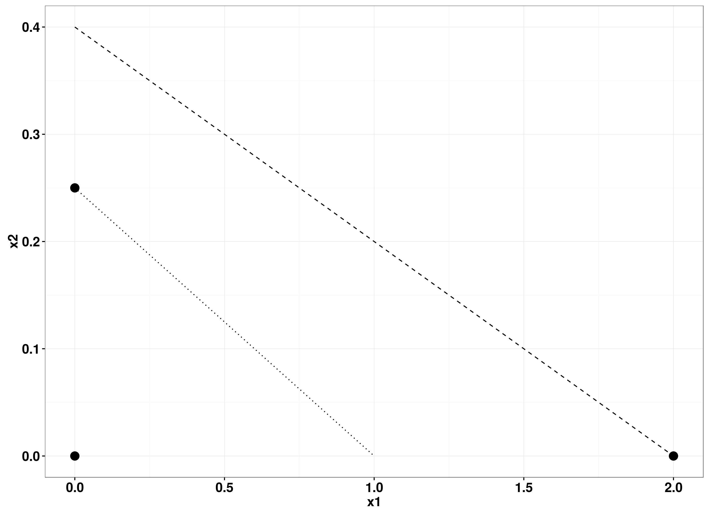 
</div>

## Four cases: Case 2 --- sp 2 wins
<div class="centered">
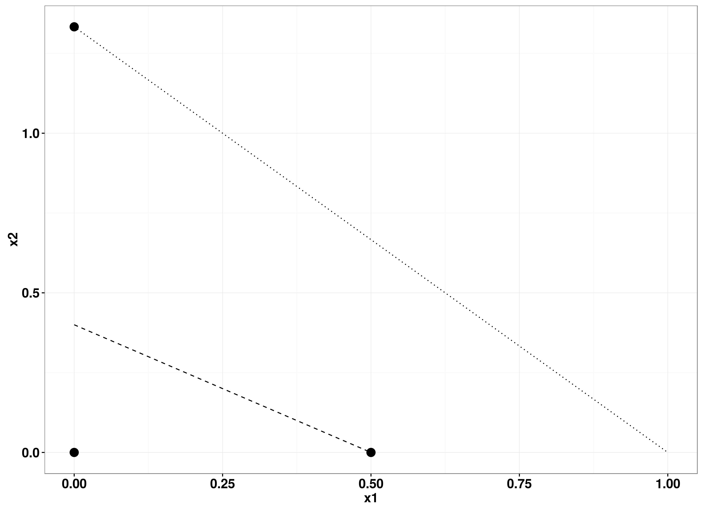 
</div>

## Four cases: Case 3 --- precedence
<div class="centered">
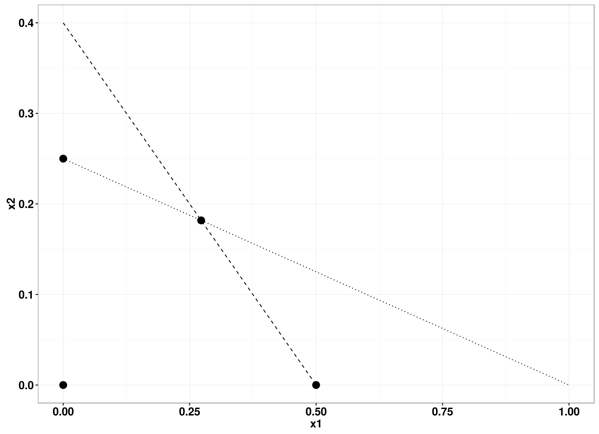 
</div>

## Four cases: Case 4 --- robust coexistence
<div class="centered">
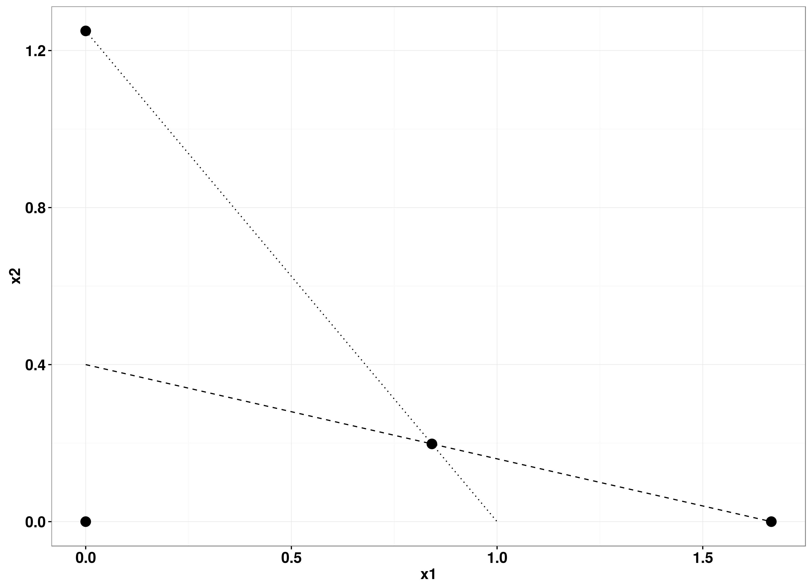 
</div>

## The principle of competitive exclusion

## More than two competitors

## Competition wrapup

## Cooperation

- Cooperation within cells --- is origin of eukaryotic organelles endosymbiontic?

- Cooperation between cells --- multicellularity

- Cooperation between individuals --- group hunting and defense

- Cooperation between species --- mutualism, symbiosis

## Cooperation is a selfish world $\Pi$

Traditionally, cooperation has been seen as problematic for evolution: 

*"As Darwin appreciated, cooperative behaviour--actions adapted to assist others that involve costs to the fitness of participants--poses a fundamental problem to the traditional theory of natural selection, which rests on the assumption that individuals compete to survive and breed"* (Clutton-Brock, 2009)

*Natural selection cannot possibly produce any modification in a species exclusively for the good of another species; though throughout nature one species incessantly takes advantage of, and profits by the structures of others. [...] If it could be proved that any part of the structure of any one species had been formed for the exclusive good of another species, it would annihilate my theory, for such could not have been produced through natural selection* (Darwin, On the origin of species, 1859)

## Prisoner's dilemma
$\,$ |  C   | D
--: | :----: | :----:
C  | R    | S
D  | T    | P

- Two strategies: **C**ooperate, **D**efect
- If Player 1 (rows) plays **C** and Player 2 (cols) plays **C**, Player 1 receives **R** (reward)
- If Player 1 plays **C** and Player 2 plays **D**, Player 1 receives **S** (sucker)
- If Player 1 plays **D** and Player 2 plays **C**, Player 1 receives **T** (temptation)
- If Player 1 plays **D** and Player 2 plays **D**, Player 1 receives **P** (punishment)

$T > R > P > S$ $\;\;\;\;$ $2 R > T + S$

## A simple case
$\,$ |  C   | D
--: | :----: | :----:
C  | 1    | 0
D  | 1+k  | k

- **k**: cost to cooperate
- **k < 1**

## Nash equilibrium
$\,$ |  C   | D
--: | :----: | :----:
C  | 1    | 0
D  | 1+k  | k

- If Pl 2 plays **C** then Pl 1 would get **1** to cooperate, and **1 + k** to defect
- If Pl 2 plays **D** then Pl 1 would get **0** to cooperate, and **k** to defect
- It is always logical to defect! 
- If Pl 2 is also rational, both will defect --- but then they would both receive lower payoffs than if they had cooperated!

## Nash Equilibrium

*"Nash equilibrium is an action profile with the property that no single player can obtain a higher payoff by deviating unilaterally from this profile."* (Int. Encyclopedia of social Sciences)

Proposed by John Nash as part of his PhD thesis in 1950 (led to Nobel Memorial Prize in Economic Sciences in 1994).

$\,$ |  C   | D
--: | :----: | :----:
C  | 1    | 0
D  | 1+k  | k


## Iterated Prisoner's Dilemma (IPD)

- What if the game is played multiple times?
- The mathematics becomes more complex
- Many possible strategies!
- There isn't a "best" strategy: whether a strategy is advantageous or not depends on which other strategies are around (frequency dependence)

## Axelrod's tournament (1980)

Robert Axelrod, a political scientist at U Michigan, invited famed game theorists to participate in a tournament of IPD.

- Each strategy consisted of a computer program.
- Each strategy played 200 turns of IPD against other strategies in a round-robin tournament, as well as against themselves.
- Repeated 5 times to remove random fluctuations.
- 14 strategies submitted, to which Axelrod added a RND strategy.

## Some strategies
- **ALLC** Always cooperate
- **ALLD** Always defect
- **RND** Cooperate with probability 50%

## Winning strategy: Tit For Tat (TFT)

- The winner was one of the simplest strategies, consisting of only two rules:
 
1. Start by playing **C**
2. Play whatever the opponent played last time

The strategy was submitted by Anatol Rapoport, a Canadian mathematical psychologist formerly at UofC.

## TFT vs ALLD

-------- --------------
 **TFT** CDDDDDDDDDDDDDDDD
**ALLD** DDDDDDDDDDDDDDDDD
-------- --------------


## TFT vs ALLC
-------- --------------
 **TFT** CCCCCCCCCCCCCCCCCC
**ALLC** CCCCCCCCCCCCCCCCCC
-------- --------------

## Axelrod's second tournament
- The following year, the tournament was repeated: 62 entries.
- The winner was again TFT! (Even though everybody knew the results of the first tournament)
- In an influential book, Axelrod noted that good strategies possessed several traits:
- *Be nice* (don't be the first to defect)
- *Be provocable* (retaliate if other player does not cooperate)
- *Don't be envious* (care about your score, not that of the opponent)
- *Don't be clever*

## Many more tournaments!
- The tournaments are still played today.
- Some strategies are extremely complex.
- Many participants submit multiple strategies meant to act in concert to boost each other's performance.
- E.g. start playing a certain sequence to see whether two programs are on the same "team"; if so, take master/slave roles.

## TFT's problem: unforgiving
The main problem of TFT is that it is unforgiving: once the opponent defects, it triggers a cascade of retaliations. 

This is problematic when communication is not perfect (either you play **D** by mistake, or a **C** is mistaken for a **D**). For example, two TFT playing in a noisy environment:

-------- --------------
**TFT1** CCCCCCCC**D**DDDDDDDDDDDDD
**TFT2** CCCCCCCCCDDDDDDDDDDDDD
-------- --------------
## Generous TFT (GTFT)
Generous Tit For Tat tries to escape this cascade of retaliation by being "forgiving": it will try restoring cooperation by playing **C** with a certain probability. 

- Start with **C**.
- If the opponent plays **C**, respond with **C**.
- If the opponent plays **D**, respond with **C** with probability 1-k; otherwise play **D**.
- The probability depends on the cost of cooperating.

## Other simple strategies
**WSLS** (Win Stay, Lose Shift)

- Start by cooperating.
- If the previous move was successful, keep playing it; otherwise, switch to the opposite move.

**GRIM** (Grim Trigger)

- Start by cooperating.
- If in the previous move both player played **C**, cooperate; otherwise defect.

## Classification of strategies
- Deterministic vs Stochastic: does the strategy involve randomness?
- Reactive vs Non-Reactive: does it react to previous moves?
- Memory 0, Memory 1/2, Memory 1: the strategy uses no information on the previous move (Memory 0); information on the previous move of the opponent (Memory 1/2); information on the previous move of both player (Memory 1).

Examples:

- **RND** (Stochastic, Non-Reactive, Memory 0)

- **TFT** (Deterministic, Reactive, Memory 1/2)

- **GTFT** (Stochastic, Reactive, Memory 1/2)

- **GRIM** (Deterministic, Reactive, Memory 1)

## Supergames

- For the IPD, it is important that the players do not know how many tournaments will be played.
- Otherwise, it is convenient to defect at the last round, but then both player will defect at the last round, making it convenient to defect at the penultimate round, and so on.
- One mathematically convenient approximation is that in which infinitely many rounds are played---early moves do not matter.
- The task of modeling infinite games (supergames) is easier if each player has a small probability of getting confused, playing the "unintended" move.

## Supergames: math $\Pi$

Vector $\mathbf{p}$ encodes the probability of playing $C$ given the previous move of both players.

$\mathbf{p} = \left\{ p_{CC}, p_{CD}, p_{DC}, p_{DD} \right\}$

e.g.:

- RND $\mathbf{p} = \left\{0.5,0.5,0.5,0.5\right\}$

- ALLD $\mathbf{p} = \left\{0,0,0,0\right\}$

- ALLC $\mathbf{p} = \left\{1,1,1,1\right\}$

## Supergames: math

- TFT $\mathbf{p} = \left\{1,0,1,0\right\}$

- GTFT $\mathbf{p} = \left\{1,1-k,1,1-k\right\}$

- GRIM $\mathbf{p} = \left\{1,0,0,0\right\}$

- WSLS $\mathbf{p} = \left\{1,0,0,1\right\}$

## Supergames: math
Probability of making mistakes: $\epsilon$

$\mathbf{p'} = (1-\epsilon) \mathbf{p} + \epsilon(\mathbf{1} - \mathbf{p})$

e.g. 

- TFT $\mathbf{p'} = \left\{1 - \epsilon, \epsilon, 1 - \epsilon, \epsilon\right\}$
- GRIM $\mathbf{p'} = \left\{1 - \epsilon, \epsilon, \epsilon, \epsilon\right\}$

## Supergames: math
- We can model the evolution of the game as a Markov Chain with four states, denoting the moves played by the two players at time $t$: CC, CD, DC, DD.
- Player 1 plays $\mathbf{p'}$; Player 2 plays $\mathbf{q'}$

$\mathbf M = \left(\begin{array}[cccc]
{}\mathbf{p'}_{1} \mathbf{q'}_{1} & \mathbf{p'}_{1} (1- \mathbf{q'}_{1}) & (1- \mathbf{p'}_{1}) \mathbf{q'}_{1} & (1 - \mathbf{p'}_{1}) (1- \mathbf{q'}_{1})\\
\mathbf{p'}_{2} \mathbf{q'}_{3} & \mathbf{p'}_{2} (1- \mathbf{q'}_{3}) & (1- \mathbf{p'}_{2}) \mathbf{q'}_{3} & (1 - \mathbf{p'}_{2}) (1- \mathbf{q'}_{3})\\
\mathbf{p'}_{3} \mathbf{q'}_{2} & \mathbf{p'}_{3} (1- \mathbf{q'}_{2}) & (1- \mathbf{p'}_{3}) \mathbf{q'}_{2} & (1 - \mathbf{p'}_{3}) (1- \mathbf{q'}_{2})\\
\mathbf{p'}_{4} \mathbf{q'}_{4} & \mathbf{p'}_{4} (1- \mathbf{q'}_{4}) & (1- \mathbf{p'}_{4}) \mathbf{q'}_{4} & (1 - \mathbf{p'}_{4}) (1- \mathbf{q'}_{4})
\end{array}
\right)$

- Note that row sum is 1 for all rows

## Stationary distribution

- Because this is a Markov Chain, and because we have the small $\epsilon$ guaranteeing that all coefficients are nonzero, the game will eventually converge to a stationary distribution.

- We can project the game forward, modeling $S_t$, the probability of being in each state at time $t$.

- $S_{t + 1} = S_t M$

- We rapidly approach a distribution of probabilities that does not change through time:

- $v M = v$

## Stationary distribution
```{r echo = FALSE, warning=FALSE, message=FALSE}
fluidRow(
  column(3,
  selectInput(inputId = "pl1",
                label = "Player 1:",
                choices = c(
                  "ALLC" = "ALLC",
                  "ALLD" = "ALLD",
                  "RND"  = "RND",
                  "TFT"  = "TFT",
                  "GTFT"  = "GTFT",
                  "GRIM" = "GRIM",
                  "WSLS" = "WSLS"),
                selected = "WSLS")),
  column(3,
  selectInput(inputId = "pl2",
                label = "Player 2:",
                choices = c(
                  "ALLC" = "ALLC",
                  "ALLD" = "ALLD",
                  "RND"  = "RND",
                  "TFT"  = "TFT",
                  "GTFT"  = "GTFT",
                  "GRIM" = "GRIM",
                  "WSLS" = "WSLS"),
                selected = "GTFT")),
  column(3,
    numericInput('ep', 'prob. error', 0.01,
                 min = 0, max = 1.0, step = 0.01)),
    
    column(3,
           numericInput('k', 'Cost cooperation', 0.5,
                 min = 0, max = 1, step = 0.1))
    )
```
```{r, echo=FALSE,message=FALSE,warning=FALSE}
library(ggplot2)
source("code/ShowMC.R")
renderPlot(height = 400, width = 800, {
    show(ShowSimulation(input$pl1, input$pl2, input$ep, input$k))
})
```

## Evolutionary game theory
- We have a population of individuals.
- Each individual has genes encoding a strategy.
- Mutations lead to individuals with different strategies.
- Mutations are rare: in this limit we will have at most two strategies at any time.
- Can mutations spread in the population?
- Only if "mutant" can invade "wildtype".
- We need to consider the average payoff (fitness) of the mutant against wildtype, mutant against mutant, wildtype against wildtype.

## Calculating average payoff (fitness)

- Matrix $M$
- Stationary distribution $\mathbf{v}$
- Player 1 plays $\mathbf{p'}$, Player 2 plays $\mathbf{q'}$
- Average payoff of Player 1: $\pi (\mathbf{p'}, \mathbf{q'}) = \mathbf{v} \mathbf{h_1}$, where $\mathbf{h_1} = \left\{ 1, 0, 1 + k, k\right\}$
- Average payoff of Player 2: $\pi (\mathbf{q'}, \mathbf{p'}) = \mathbf{v} \mathbf{h_2}$, where $\mathbf{h_2} = \left\{ 1, 1 + k, 0, k\right\}$

## Avergage Fitness

```{r echo = FALSE, warning=FALSE, message=FALSE}
fluidRow(
  column(3,
  selectInput(inputId = "pl1_2",
                label = "Player 1:",
                choices = c(
                  "ALLC" = "ALLC",
                  "ALLD" = "ALLD",
                  "RND"  = "RND",
                  "TFT"  = "TFT",
                  "GTFT"  = "GTFT",
                  "GRIM" = "GRIM",
                  "WSLS" = "WSLS"),
                selected = "ALLC")),
  column(3,
  selectInput(inputId = "pl2_2",
                label = "Player 2:",
                choices = c(
                  "ALLC" = "ALLC",
                  "ALLD" = "ALLD",
                  "RND"  = "RND",
                  "TFT"  = "TFT",
                  "GTFT"  = "GTFT",
                  "GRIM" = "GRIM",
                  "WSLS" = "WSLS"),
                selected = "ALLD")),
  column(3,
    numericInput('ep_2', 'prob. error', 0.01,
                 min = 0, max = 1.0, step = 0.01)),
    
    column(3,
           numericInput('k_2', 'Cost cooperation', 0.7,
                 min = 0, max = 1, step = 0.1))
    )
```
```{r, echo=FALSE,message=FALSE,warning=FALSE}
library(ggplot2)
source("code/MCIPD.R")
renderPlot(height = 400, width = 800, {
    show(PlotPayOffs(input$pl1_2, input$pl2_2, input$ep, input$k_2))
})
```

## War and Peace: ALLC vs ALLD

Start with a population composed of cooperators: can **ALLD** invade?

## ALLD can invade ALLC

<div class="centered">
 
</div>

Can **ALLD** be invaded by **TFT**?

## TFT can invade ALLD

<div class="centered">
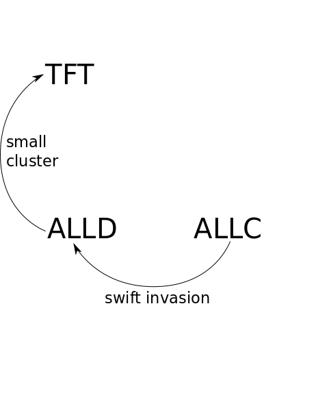 
</div>

Can **TFT** be invaded by **GTFT**?


## GTFT can invade TFT

<div class="centered">
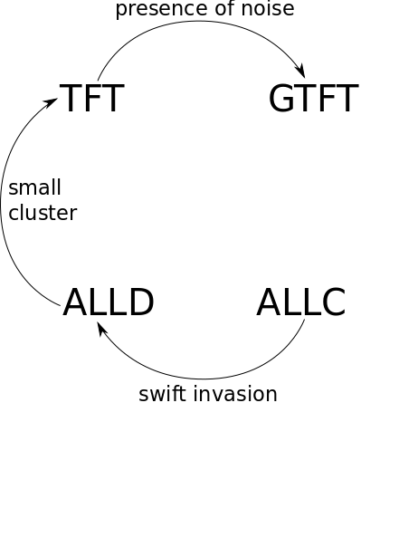 
</div>

Can **GTFT** be invaded by **ALLC**, closing the cycle?

## The cycle: War and Peace

<div class="centered">
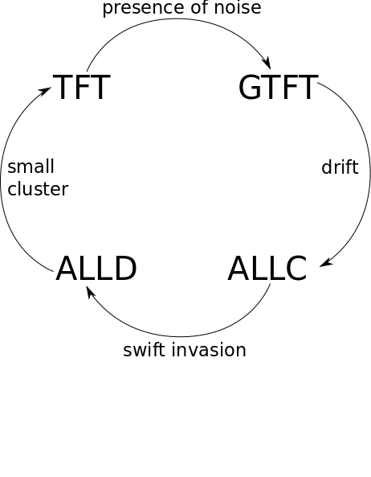 
</div>

What about **WSLS**?

## The cycle: War and Peace

<div class="centered">
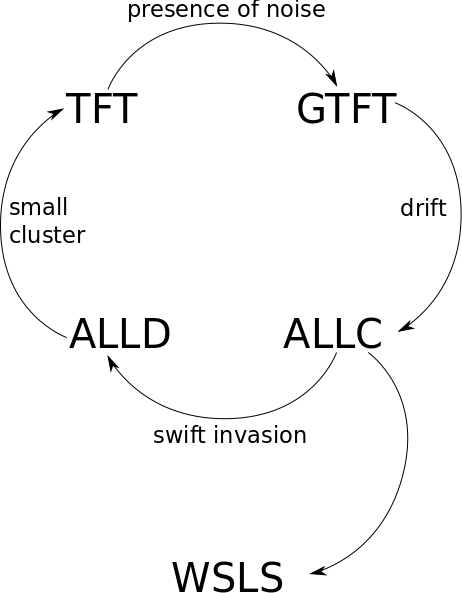 
</div>

Is **WSLS** invasible?

## The cycle: War and Peace

<div class="centered">
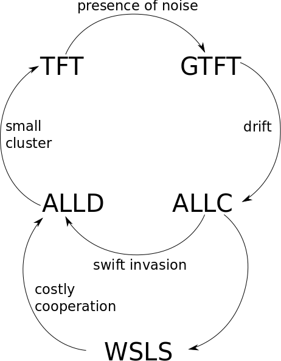 
</div>

## The cycle: War and Peace

*There is one thing that I have learned in my studies of cooperation over the last 20 years: there is no equilibrium. There is never a stable equilibrium. Cooperation is always being destroyed and has to be rebuilt.* (Martin Nowak)

## Other mechanisms for cooperation

- We have played with **direct reciprocity** (I scratch your back, you scratch my back)
- Another key mechanism is **indirect reciprocity** (golden rule --- I scratch your back, somebody will scratch mine)
- Indirect reciprocity can lead to emergence of cooperation when **reputation** is at stake
- *"For direct reciprocity you need a face; for indirect reciprocity you need a name."* (David Haig)

## Spatial cooperation $\Pi$

- Cooperation can also emerge in a spatial context -- **ALLD** cannot wipe out **ALLC** in a spatial game

<div class="centered">
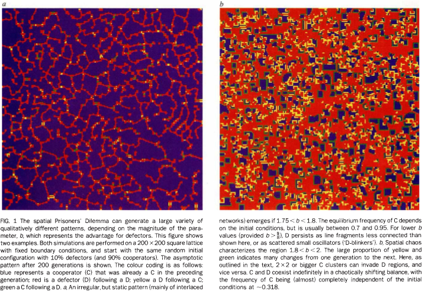 

Nowak and May, 1992
</div>

## Spatial cooperation $\Pi$

<div class="centered">
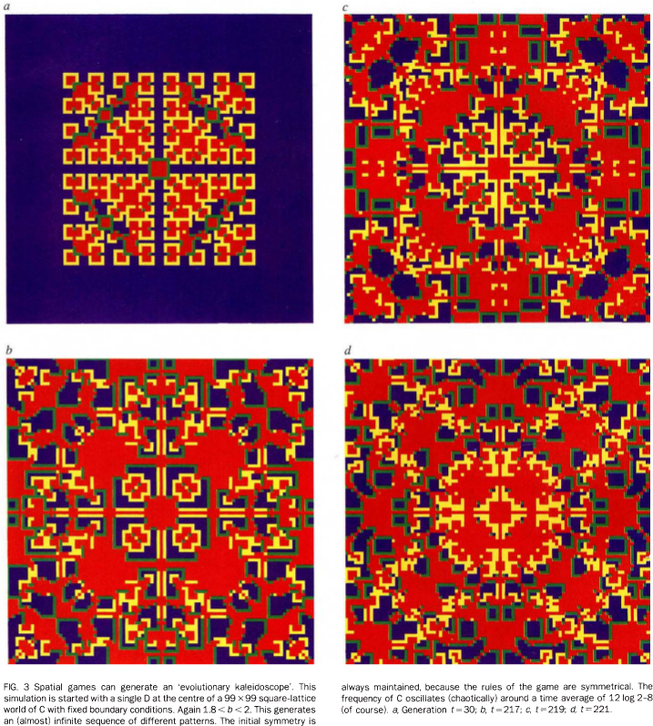 

Nowak and May, 1992
</div>

## Multilevel selection

- Evolutionary game theory has been applied to multilevel selection
- Group selection
- Kin selection

## Cooperation wrapup

- Cooperation can emerge through mutations in an otherwise non-cooperative population.
- However, a cycle ensues in which cooperative strategies raise and fall.
- Many mechanisms can give rise to cooperative behavior, including direct reciprocity, indirect reciprocity, spatial patterns, and group/kin selection.

## Interactions matter

